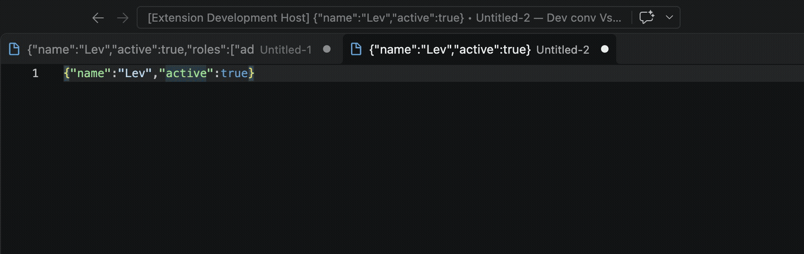
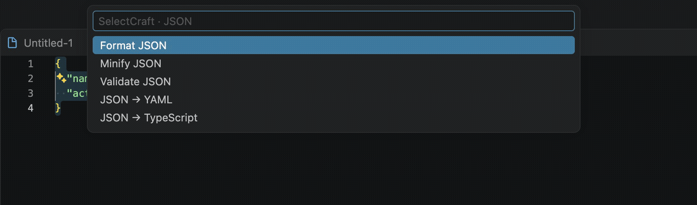

# SelectCraft — JSON, JWT & Text Tools for VS Code

Format and validate JSON, generate TypeScript and JSON Schema, convert YAML, decode JWT and Base64, and transform URLs, dates, UUIDs, and text — without leaving VS Code. SelectCraft runs locally and works offline.

**Version:** 1.0.0 · **Requires:** VS Code 1.90 or newer · **License:** MIT

## Get started

1. Select text in an editor.
2. Press **⌘⇧D** on macOS or **Ctrl+Shift+D** on Windows and Linux.
3. Choose a relevant action. SelectCraft applies the result to your selection or asks where structured output should go.



You can also run **SelectCraft: Smart Action** from the Command Palette (**⌘⇧P** / **Ctrl+Shift+P**), or right-click selected text. If another extension uses the shortcut, the Command Palette still works.

## What you can do

| Select or enter | Actions                                                                                       |
| --------------- | --------------------------------------------------------------------------------------------- |
| JSON            | Format, minify, validate, convert to YAML or TypeScript, generate JSON Schema                 |
| YAML            | Convert to formatted JSON                                                                     |
| JWT             | Decode header and payload, inspect `exp` / `iat` / `nbf` dates, copy payload                  |
| Base64          | Encode or decode UTF-8 text                                                                   |
| URL             | Encode or decode components, parse a URL or query parameters                                  |
| Dates           | Convert Unix seconds, milliseconds, and ISO 8601 dates                                        |
| UUID            | Generate UUID v4 or validate a UUID                                                           |
| Text            | Convert camelCase, PascalCase, snake_case, kebab-case, CONSTANT_CASE, lowercase, or UPPERCASE |

Every action is also available by name in the Command Palette. The editor context menu keeps common actions close at hand: Smart Action, Format JSON, Minify JSON, Decode JWT, and Base64 Decode.

## JSON to TypeScript

Select a JSON object and run **SelectCraft: JSON to TypeScript**. SelectCraft creates declarations for nested objects and reuses a declaration when array objects share the same shape. Choose to replace the selection, preview a diff, open the result in a new editor, or copy it.



Configure the declaration kind, root name, `export` keyword, and optional properties in Settings. Optional properties applies `?` to every generated property; it does not infer optionality from a single JSON sample.

## JSON to JSON Schema

Run **SelectCraft: JSON to JSON Schema** on a representative JSON sample to generate a Draft 2020-12 schema. The generator infers nested object properties, required keys, numeric types, and mixed array item types. Empty arrays use an unconstrained `items` schema because there are no sample values to infer.

The generated schema describes the sample: every key present in an object is marked required, and additional properties are disallowed. Review the schema before using it as an API contract.

## Results and safety

- **Replace** is the default for ordinary text transformations.
- Structured results such as TypeScript and JSON Schema offer **Replace Selection**, **Preview Diff**, **Open in New Editor**, and **Copy Result**.
- Set the result behavior to **Preview** to inspect a diff and confirm before applying each transformation. SelectCraft checks that the source document has not changed while the preview is open.
- With no selection, clipboard fallback can offer **Copy Result**, **Insert Result at Cursor**, or **Open Result in New Editor**. You can disable clipboard fallback in Settings.
- Simple text transformations apply independently to every selected range.
- JSON and UUID validation report a result without changing the editor.

JWT decoding displays the header and payload but does not verify the token signature or establish authenticity. Do not treat decoded claims as trusted.

## Settings

Open Settings and search for **SelectCraft**, or add these values to `settings.json`:

| Setting                                     | Default       | Purpose                                                                 |
| ------------------------------------------- | ------------- | ----------------------------------------------------------------------- |
| `selectcraft.json.indentation`              | `"2"`         | Indentation for JSON and generated TypeScript: `"2"`, `"4"`, or `"tab"` |
| `selectcraft.smartAction.clipboardFallback` | `true`        | Read the clipboard when there is no selection                           |
| `selectcraft.defaultResultBehavior`         | `"replace"`   | `"replace"`, `"copy"`, `"ask"`, or `"preview"`                          |
| `selectcraft.typescript.kind`               | `"interface"` | Generate `interface` or `type` declarations                             |
| `selectcraft.typescript.rootName`           | `"Root"`      | Name the root TypeScript declaration                                    |
| `selectcraft.typescript.export`             | `false`       | Add `export` to generated declarations                                  |
| `selectcraft.typescript.optionalProperties` | `false`       | Mark all generated properties optional                                  |

For example, to preview every transformation and generate exported types named `ApiResponse`:

```json
{
  "selectcraft.defaultResultBehavior": "preview",
  "selectcraft.typescript.kind": "type",
  "selectcraft.typescript.rootName": "ApiResponse",
  "selectcraft.typescript.export": true
}
```

## Install and run locally

For development, install **Node.js 20 or newer** and run:

```sh
npm ci
npm run build
```

Open the project folder in VS Code and press **F5** to launch an Extension Development Host with SelectCraft enabled. After code changes, run **Developer: Reload Window** in that host.

To build and install a local VSIX:

```sh
npm run package
```

Then run **Extensions: Install from VSIX...** and select `selectcraft-1.0.0.vsix` from the project folder.

## Troubleshooting

- **No action appears:** select text and run **SelectCraft: Smart Action** from the Command Palette. If clipboard fallback is disabled, a selection is required.
- **The shortcut opens another command:** run Smart Action from the Command Palette or change the keybinding in Keyboard Shortcuts.
- **JSON conversion fails:** run **SelectCraft: Validate JSON** to check the selected text and locate syntax errors.
- **A result is not what you expected:** use **Preview Diff** or set `selectcraft.defaultResultBehavior` to `"ask"` before applying it.

## Privacy

SelectCraft processes selected text and clipboard input only when you invoke a command. It has no account, analytics, telemetry, or external API calls. YAML support is bundled with the extension. JWT decoding is local and does not verify signatures.

## Development checks

```sh
npm test
npm run test:integration
npm run lint
npm run format:check
npm run build
npm run package
```

The VS Code integration suite covers Smart Action, diff confirmation, TypeScript settings, JSON Schema output, cursor insertion, multiple selections, and clipboard delivery.

## Automated releases

The [GitHub Actions release workflow](.github/workflows/release.yml) runs for version tags such as `v1.0.0`. It checks the tag and publisher, runs lint, formatting, unit and VS Code integration tests, packages a VSIX, publishes to the VS Code Marketplace, and attaches the VSIX to a GitHub Release. The workflow rewrites GIF links to public, commit-specific URLs for Marketplace rendering.

Before the first Marketplace release:

1. Confirm the VS Code Marketplace publisher is `levkosyk`.
2. Keep the project in the public [LevKosyk/SelectCraft repository](https://github.com/LevKosyk/SelectCraft) so Marketplace users can view the demo GIFs.
3. Configure Marketplace credentials. For [Microsoft Entra ID with GitHub OIDC](https://code.visualstudio.com/api/working-with-extensions/publishing-extension#secure-automated-publishing-to-visual-studio-marketplace), set `AZURE_CLIENT_ID`, `AZURE_TENANT_ID`, and `AZURE_SUBSCRIPTION_ID` as repository Actions variables and create a federated credential for `repo:LevKosyk/SelectCraft:environment:marketplace`. Alternatively, add a `VSCE_PAT` repository secret with Marketplace (Manage) scope.
4. Update the version in `package.json`, create the matching version tag, and push it.

No publishing credentials are stored in this repository.

## Support

Report bugs or request features in [GitHub Issues](https://github.com/LevKosyk/SelectCraft/issues).

## License

MIT. See [LICENSE](LICENSE) and [changelog.md](changelog.md) for project details.
