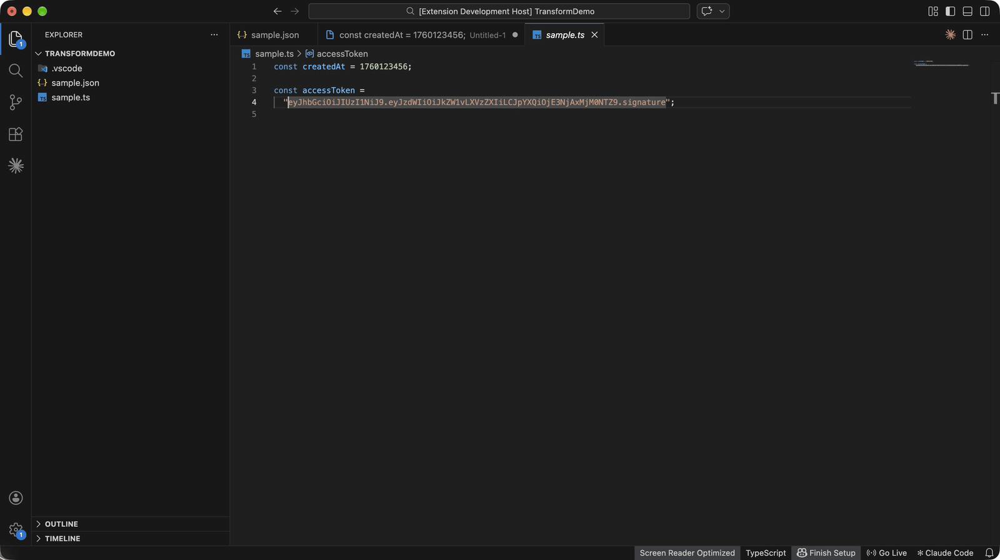
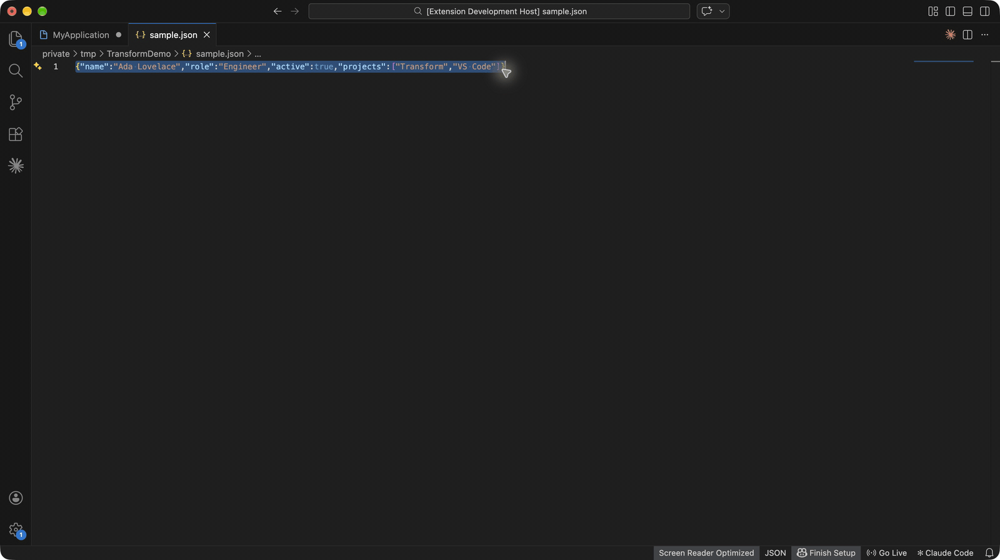

# Transform — JSON Formatter, JWT Decoder & Developer Tools for VS Code

Format and validate JSON, decode JWTs, convert JSON to TypeScript, Zod, Go, Python, and Rust, convert YAML, CSV, TOML, and JSON5, and see decoded timestamps, JWTs, and Base64 on hover. One extension replaces a drawer of single-purpose tools, and everything runs **100% offline**.

**VS Code 1.90+** · **Cursor, Windsurf & VSCodium via Open VSX** · **Offline** · **No telemetry** · **MIT License**

## Quick start

1. Select text in an editor.
2. Press **⌥⌘X** (macOS) or **Ctrl+Alt+X** (Windows/Linux).
3. Pick an action. Transform detects what you selected — JSON, JWT, Base64, YAML, CSV, a timestamp, a URL — and shows only the actions that fit.


Every action is also in the Command Palette under **Transform:** and in the editor's right-click menu.

## Why Transform

- **Smart Action** — one shortcut, the right tools for whatever you selected.
- **Hover previews** — hover a Unix timestamp, JWT, or Base64 string to read it without selecting anything.
- **Go to Error** — invalid JSON, YAML, TOML, or JSONC errors jump straight to the line and column.
- **Every cursor** — text actions apply to each selection, and generators insert a unique ID at every cursor.
- **Private by design** — no account, no network calls, no telemetry.

## Hover previews

Hover a value in any file:

- **Unix timestamp** (seconds or milliseconds) — UTC, local time, and how long ago.
- **JWT** — expiry status, header, and payload.
- **Base64** — the decoded text, when it is readable.



Turn hovers off with `transform.hover.enabled`.

## JSON formatter and validator

- **Format**, **minify**, and **sort keys** recursively (array order is kept).
- **Validate JSON** with the exact line, column, and cause, including comments and trailing commas.
- **Escape** text as a JSON string, or **unescape** JSON copied from logs, such as `"{\"user\":{\"id\":1}}"`, and format it in one step.
- With nothing selected, JSON commands use the whole open JSON document.

## JSON to TypeScript, Zod, Go, Python, and Rust

Paste a JSON sample and generate types. Nested objects become named types, and objects with the same shape share one type.

```json
{ "userId": 1, "display-name": "Ada", "tags": ["admin"] }
```

| Output            | Result                                                                               |
| ----------------- | ------------------------------------------------------------------------------------ |
| TypeScript        | `interface Root { userId: number; "display-name": string; tags: string[]; }`         |
| Zod               | `z.object({ userId: z.number().int(), "display-name": z.string(), ... })` with types |
| Go                | ``UserID int64 `json:"userId"` `` — aligned like `gofmt`, with Go initialisms        |
| Python (Pydantic) | `user_id: int = Field(alias="userId")`                                               |
| Rust (serde)      | `#[serde(rename = "userId")] pub user_id: i64`                                       |
| JSON Schema       | Draft 2020-12 schema with required keys and array item types                         |



Settings choose `interface` or `type`, the root type name, `export`, and whether every property is optional. Optional properties apply to all languages; Transform does not guess optionality from one sample.

## JWT decoder

Decode the header and payload of a JSON Web Token, see whether it is expired ("Expired 3 hours ago", "Valid (expires in 2 days)"), and read `exp`, `iat`, and `nbf` as dates. **Copy Payload** copies the claims as JSON. Signatures are not verified, so decoded claims are not proof of authenticity.

## YAML, CSV, TOML, and JSON5 converter

- **JSON ↔ YAML**, **JSON ↔ CSV**, **JSON ↔ TOML**, and **JSON ↔ JSON5**.
- **YAML ↔ JSONC that keeps comments**, so annotated config files survive the round trip.
- CSV conversion detects commas, semicolons, or tabs, reads numbers and booleans, and flattens nested objects into `address.city` columns.

## JSON path

- **Copy JSON Path at Cursor** copies a path such as `$.users[0].email` (also in the right-click menu for JSON files).
- **Query JSON Path…** runs a query such as `$.users[*].email` or `$..id`. Supports `.key`, `["key"]`, `[0]`, `[-1]`, `[*]`, `.*`, and `..key`.

## Encoders, dates, IDs, hashes, and case

| Tool       | Actions                                                                                                                                  |
| ---------- | ---------------------------------------------------------------------------------------------------------------------------------------- |
| Base64     | Encode and decode UTF-8 text                                                                                                             |
| URL        | Encode and decode, parse a URL, parse query parameters                                                                                   |
| Timestamps | Convert Unix seconds, milliseconds, and ISO 8601                                                                                         |
| IDs        | Generate UUID v4, UUID v7, ULID, and Nano ID at every cursor; validate a UUID                                                            |
| Hash       | MD5, SHA-1, SHA-256, and SHA-512                                                                                                         |
| Case       | camelCase, PascalCase, snake_case, kebab-case, CONSTANT_CASE, Title Case, Sentence case, dot.case, path/case, slug, lowercase, UPPERCASE |

## Results

The selection is replaced by default. Structured results such as generated types also offer **Preview Diff**, **Open in New Editor**, and **Copy Result**. Set `transform.defaultResultBehavior` to `"preview"` to review every change before it is applied. With no selection, Transform can read the clipboard and insert, copy, or open the result.

## Settings

| Setting                                   | Default       | Purpose                                                          |
| ----------------------------------------- | ------------- | ---------------------------------------------------------------- |
| `transform.json.indentation`              | `"2"`         | Indentation for JSON, TypeScript, and Zod: `"2"`, `"4"`, `"tab"` |
| `transform.defaultResultBehavior`         | `"replace"`   | `"replace"`, `"copy"`, `"ask"`, or `"preview"`                   |
| `transform.smartAction.clipboardFallback` | `true`        | Read the clipboard when no text is selected                      |
| `transform.hover.enabled`                 | `true`        | Show decoded values on hover                                     |
| `transform.codegen.rootName`              | `"Root"`      | Root type name for TypeScript, Zod, Go, Python, and Rust         |
| `transform.codegen.optionalProperties`    | `false`       | Mark every generated property optional                           |
| `transform.typescript.kind`               | `"interface"` | TypeScript `interface` or `type`                                 |
| `transform.typescript.export`             | `false`       | Export generated TypeScript declarations                         |

## Privacy

Transform has no account, telemetry, analytics, or network calls. It reads the selection, document, or clipboard only when you run a command, and hover previews only decode the value under the cursor. After regular use it may ask once for a rating; **Later** and **Don't Ask Again** snooze or stop it.

## FAQ

**How do I format JSON in VS Code?**
Select the JSON, or open a `.json` file with nothing selected, and run **Transform: Format JSON** — or press **⌥⌘X** / **Ctrl+Alt+X** and pick **Format JSON**. Minify and sort keys work the same way.

**How do I decode a JWT in VS Code?**
Hover the token to see its header, payload, and expiry status, or select it and run **Transform: Decode JWT**. Decoding happens locally; the token never leaves your machine.

**How do I convert JSON to TypeScript, Zod, Go, Python, or Rust?**
Select a JSON sample, press **⌥⌘X** / **Ctrl+Alt+X**, and pick the language — or run **Transform: JSON to TypeScript**, **JSON to Zod Schema**, **JSON to Go Structs**, **JSON to Python (Pydantic)**, or **JSON to Rust (serde)** from the Command Palette.

**How do I convert a Unix timestamp to a date?**
Hover the timestamp, or select it and run **Transform: Timestamp to Date**. Seconds and milliseconds are both detected.

**Does Transform send my data anywhere?**
No. There are no network calls and no telemetry, so it is safe for tokens, credentials, and production data.

## Feedback and support

Found a bug or want a tool added? Open an issue on [GitHub](https://github.com/LevKosyk/Transform/issues). If Transform saves you time, a rating on the Marketplace helps other developers find it.

See the [changelog](changelog.md) for release notes, [CONTRIBUTING.md](CONTRIBUTING.md) to build from source, and [ThirdPartyNotices.txt](ThirdPartyNotices.txt) for bundled libraries. Licensed under [MIT](LICENSE).
